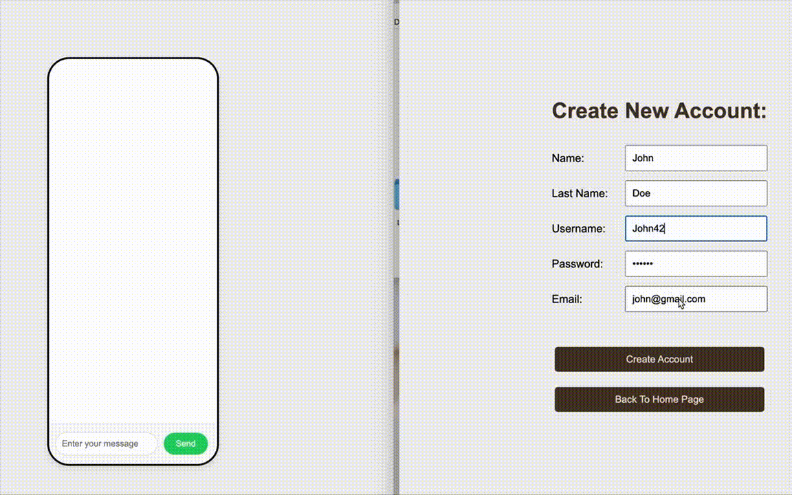

# LiveChat  
A real-time chat application built with the MERN stack (MongoDB, Express, React, Node.js), featuring a **user registration page**, **simple login system**, **Redux** for state management, **React Router** for navigation, and **WebSocket** for seamless, real-time communication. This project highlights a complete authentication flow alongside live messaging in a modern web application.

## Features  
- **User Registration & Login:** A basic and user-friendly registration and login system.  
- **Real-Time Messaging:** Powered by WebSocket for instant communication.  
- **State Management:** Redux ensures smooth handling of complex application state.  
- **Routing:** React Router enables smooth navigation between pages.  
- **Responsive UI:** A clean, intuitive interface built with React, optimized for all devices.  
- **Backend API:** Node.js and Express provide a scalable and efficient server.  
- **Database Integration:** MongoDB handles data storage for user accounts and chat messages.  
- **Scalable Architecture:** Designed to support multiple concurrent users with real-time updates.  

## Tech Stack  
- **Frontend:** React, Redux, React Router  
- **Backend:** Node.js, Express, WebSocket  
- **Database:** MongoDB  
- **Other Tools:** Axios  

## Installation  
1. Clone the repository:  
   ```bash  
   git clone https://github.com/noystrolovich/LiveChat.git  
   ```  
2. Navigate to the project directory:  
   ```bash  
   cd LiveChat  
   ```  
3. Install dependencies for both the client and server:  
   ```bash  
   cd client  
   npm install  
   cd ../server  
   npm install  
   ```  
4. Start the development server:  
   ```bash  
   cd server  
   node index.js  
   ```  
5. Start the React app:  
   ```bash  
   cd ../client  
   npm run dev  
   ```  

## Usage  
- Access the application in your browser at `http://localhost:3000`.  
- Register a new account or log in with existing credentials.  
- Navigate between pages using React Router.  
- Start chatting with other users in real time!  

## Contribution  
Contributions are welcome! Please fork this repository and submit a pull request with any enhancements or bug fixes.

## License  
This project is licensed under the MIT License. See the LICENSE file for details.
